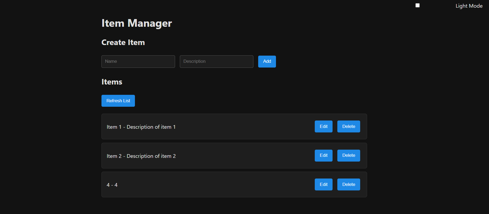
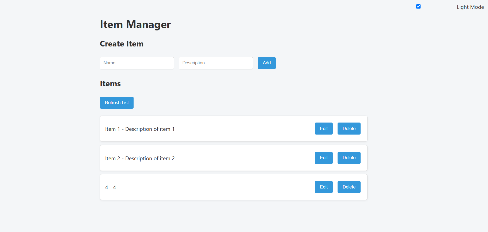

# JAMStack CRUD Vault

A basic CRUD application built using the JAMstack architecture.

## 🚀 Features

* **Create, Read, Update, Delete** operations
* **Static frontend** served from the `public` directory
* **Serverless functions** for backend logic
* **JSON file** for data storage

## 📁 Project Structure

```
JAMStack-CRUD-Vault/
├── controllers/
├── data/
├── models/
├── netlify/functions/
├── public/
├── views/
├── netlify.toml
├── package.json
└── server.js
```

## 🛠️ Getting Started

### Prerequisites

* [Node.js](https://nodejs.org/) installed
* [Netlify CLI](https://docs.netlify.com/cli/get-started/) installed globally

### Installation

1. **Clone the repository:**

   ```bash
   git clone https://github.com/Prxyankaz/JAMStack-CRUD-Vault.git
   cd JAMStack-CRUD-Vault
   ```

2. **Install dependencies:**

   ```bash
   npm install
   ```

3. **Start the development server:**

   ```bash
   netlify dev
   ```

4. **Access the application:**

   Open your browser and navigate to `http://localhost:8888/`

## screenshots of working
DARK MODE

LIGHT MODE


## 🤝 Contributing

Contributions are welcome! Please fork the repository and submit a pull request for any enhancements or bug fixes.


